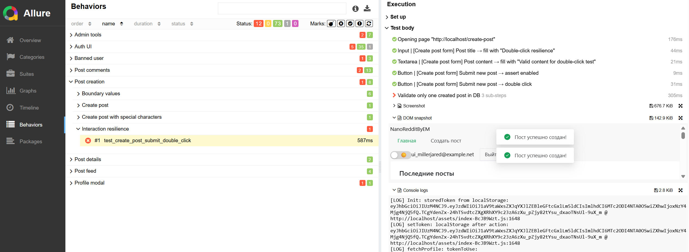

## Цель проекта

Автотесты покрывают основные сценарии пользовательского интерфейса NanoReddit (регистрация, авторизация, создание постов, комментарии, профиль, админка), чтобы быстро обнаруживать регрессии и проблемы в UI/UX.

## Технологии

- Python 3.11+ и стандартная библиотека
- Pytest как тестовый раннер
- Playwright для автоматизации браузера (async API)
- Pydantic-схемы и `pydantic-settings` для моделей и конфигурации
- Faker и вспомогательные утилиты для генерации данных
- Allure для формирования отчётов
- `python-dotenv` и переменные окружения для секретов и конфигов
- `psycopg2-binary` для работы с базой данных (валидация данных)

### Структура проекта

- **`tests/`**: сами тесты (`test_auth.py`, `test_post_creation.py`, `test_comments.py`, `test_profile_modal.py`, `test_admin.py` и др.).
- **`ui/pages/`**: Page Objects для страниц приложения (HomePage, LoginPage, RegisterPage, CreatePostPage, PostPage).
- **`ui/widgets/`**: переиспользуемые компоненты интерфейса (Navbar, PostCard, CommentsSection, UserProfileModal и др.).
- **`ui/page_factory/`**: базовые UI элементы (Button, Input, Textarea, Link, Text и др.).
- **`models/`**: модели данных (DTO для запросов/ответов API).
- **`utils/`**: вспомогательный код (фикстуры, клиенты API/SQL, ассершены, генераторы данных, хелперы для БД).
- **`reports/`**: артефакты прогонов тестов (Allure-результаты, баг-репорты и т.п.).
- **`settings.py`**: базовые настройки проекта (URLs, креды БД, таймауты и пр.).

### Установка и запуск

1. **Клонировать репозиторий**:

```bash
git clone https://github.com/maxdiksteinwork/nanoreddit-ui-autotests.git
cd nanoreddit-ui-autotests
```

2. **Создать и активировать виртуальное окружение (рекомендуется)**:

```bash
python -m venv .venv
.venv\Scripts\activate  # Windows
source .venv/bin/activate  # Linux/MacOS
```

3. **Установить зависимости**:

```bash
# Установить pip-tools (если еще не установлен)
pip install pip-tools

# Скомпилировать requirements.txt из requirements.in
pip-compile requirements.in

# Установить зависимости
pip install -r requirements.txt
```

4. **Установить браузеры для Playwright**:

```bash
playwright install chromium
```

5. **Настроить переменные окружения**:

Создайте файл `.env` (или `.env.local`, `.env.dev` и т.д. в зависимости от окружения):

```env
BASE_URL=http://localhost:3000
API_BASE_URL=http://localhost:8080
DB_HOST=localhost
DB_PORT=5432
DB_NAME=nanoreddit
DB_USER=postgres
DB_PASSWORD=your_password
HEADLESS=false
```

6. **Запуск тестов**:

```bash
# Запуск всех тестов
pytest

# Запуск с указанием окружения
pytest --env=local

# Запуск конкретного теста
pytest tests/test_auth.py::test_register_user_success
```

### Allure-отчёты

Тесты автоматически генерируют Allure-результаты в `reports/allure-results` (настроено в `pytest.ini`).

Для просмотра отчёта локально:

```bash
# Запустить локальный сервер с отчётом
allure serve reports/allure-results
```

Это откроет интерактивный отчёт в браузере на `http://localhost:random-port`.

**Скриншот отчёта**



### Управление зависимостями

Проект использует `pip-tools` для управления зависимостями:

- **`requirements.in`**: минимальные прямые зависимости проекта (для разработки)
- **`requirements.txt`**: скомпилированный файл с точными версиями всех зависимостей (для воспроизводимости)

**При добавлении новой зависимости:**

```bash
# 1. Добавить в requirements.in
echo "new-package>=1.0.0" >> requirements.in

# 2. Скомпилировать
pip-compile requirements.in

# 3. Установить
pip install -r requirements.txt
```

**При обновлении зависимостей:**

```bash
pip-compile --upgrade requirements.in
```

### Принципы архитектуры

- **Page Factory**: описывает элементарные компоненты (кнопки, поля ввода) с едиными шагами Allure и переиспользуемой логикой.
- **Page Object**: агрегирует компоненты и виджеты, формируя осмысленные действия страницы.
- **Widgets**: переиспользуемые составные компоненты интерфейса (модалки, формы, списки).
- **Фикстуры**: готовят данные и окружение (браузер, тестовые пользователи, посты) до запуска тестов.
- **Allure**: собирает шаги, прикладывает скриншоты, DOM-снимки, console logs и SQL-запросы при падении тестов.

### Баг-репорты

Найденные баги документируются в `reports/bugs/` в формате текстовых файлов с описанием проблемы, шагами воспроизведения, ожидаемым и фактическим результатом, severity и priority.
